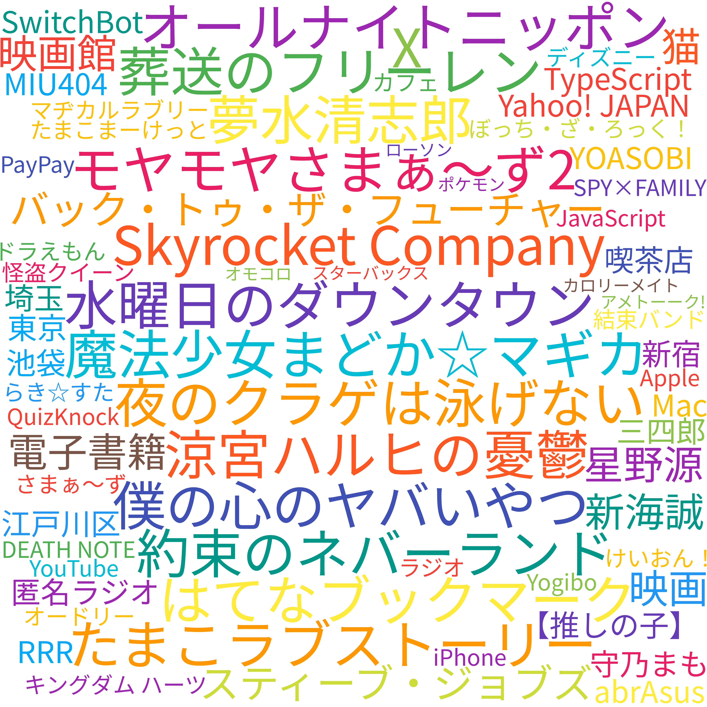

[](https://github.com/munierujp/wordcloud/actions/workflows/build.yml)
[](https://github.com/munierujp/wordcloud/actions/workflows/lint.yml)
[](https://github.com/munierujp/wordcloud/actions/workflows/test.yml)

# wordcloud

My word clouds

## Images
### あなたぐ風



### Google Slides


### 食べログ


https://tabelog.com/rvwr/munieru/

### Twitter


https://twitter.com/munieru_jp

### Zoom


## Usage

### Generate word clouds

To generate word clouds, run the following command:

```sh
npm start
```

### Update images for each sites

To update images for each site, upload them manually from links below:

- [Twitter](https://twitter.com/settings/profile)
- [食べログ](https://tabelog.com/rvwr/munieru/)
